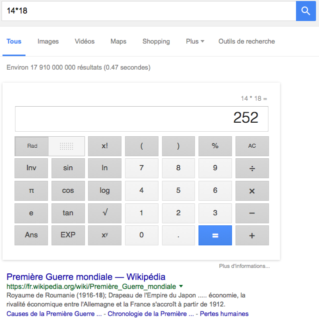
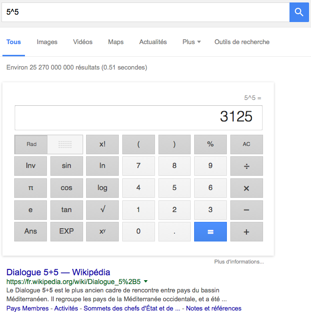
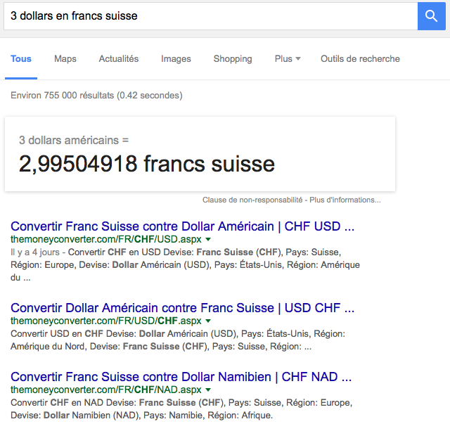
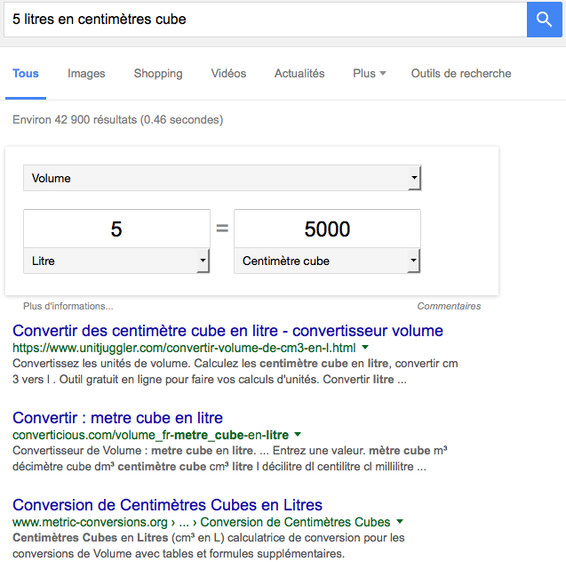
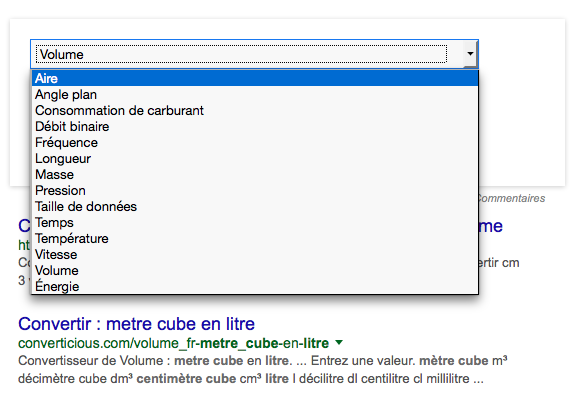

% Advanced Engine Search
% Alexandre Racine - Igor Milhit
% 2 mars 2016

# Introduction

## *Google Search*

* partout, tout le temps
* *Google* me connaît mieux que moi-même
* intrusif mais **efficace**

## *Google Search*

...pourtant, *parfois*, le besoin d'aller plus loin se fait sentir.

* Qui connaît la recherche avancée de *Google* ?
* Qui l'utilise ?
* Et la syntaxe de recherche, c'est... ?

## Fonctionnement de base

* Par mots clés : ``panda roux``
* Opérateur par défaut : ``ET``
* Phrases simples : ``l'aéroport le plus proche``

## Terme manquant

Exemple : [https://www.google.ch/search?q=panda+python+goudron](https://www.google.ch/search?q=panda+python+goudron)

## Exercice pratique ``facile !``

Nous voulons acheter du *thé vert japonais* à la fin de notre journée de travail.

Proposez-nous des adresses.

[Solution](https://www.google.ch/search?q=thé-vert-japonais)

# Des mots clés particuliers

## Définition

``définition [terme]``   
fait apparaître la définition du terme avant les résultats.

## Météo

Quel temps fait-il à *New Dehli* ?

``météo dehli`` : [https://www.google.ch/search?q=météo+dehli](https://www.google.ch/search?q=météo+dehli)

## Calcul

Peut donner le résultat d'un calcul :

## Exercice pratique

Trouvez comment obtenir le résultat de *5 à la puissance 5*

## Résultat

## Conversion d'unité

## Exercice pratique

* Essayez de convertir des unités de volume  
Ex :``litres vers cm3``
* Explorez maintenant les autres possibilités de conversion d'unités

## Résultat

# Recheche avancée

## Où ?

## Présentation de la Recherche avancée

exemple stats bibliothèque

## Mise en évidence syntaxe

amélioration dans le champ proposé par google

# Autres opérateurs

## Exemples

* ``inurl:``
* ``cache:``
* ``OR``, ``|``
* ``" "``
* ``*``(troncature)
