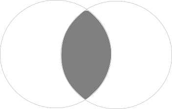

% Advanced Engine Search
% Alexandre Racine - Igor Milhit
% 2 mars 2016 - [sources](https://github.com/iGormilhit/aes)

# Introduction

## *Google Search*

* Partout, tout le temps
* *Google* me connaît mieux que moi-même
* Intrusif mais **efficace**

## *Google Search*

...pourtant, *parfois*, le besoin d'aller plus loin se fait sentir.

* Qui connaît la recherche avancée de *Google* ?
* Qui l'utilise ?
* Et la syntaxe de recherche, c'est... ?

## Recherche simple

* Par mots clés : ``panda roux``
* Opérateur par défaut : ``ET``

* Phrases simples : ``l'aéroport le plus proche``

## Terme <strike>manquant</strike>

Exemple :   
[https://www.google.ch/search?q=panda+python+goudron](https://www.google.ch/search?q=panda+python+goudron)

## Exercice pratique

Nous voulons acheter du *thé vert japonais* à la fin de notre journée de travail.

Proposez des adresses.

[Solution](https://www.google.ch/search?q=thé+vert+japonais)

# Des mots clés particuliers

## Définition

``définition [terme]``   
fait apparaître la définition du terme avant les résultats.

``définition classification`` :   
[https://www.google.ch/search?q=définition+classification](https://www.google.ch/search?q=définition+classification)

## Météo

Quel temps fait-il à *New Dehli* ?

``météo dehli`` :   
[https://www.google.ch/search?q=météo+dehli](https://www.google.ch/search?q=météo+dehli)

Vous pouvez faire quelques tests... Quelle est la source ? Est-ce toujours correct ?

## Calcul

Pour obtenir le résultat d'un calcul :

14 x 18 → 14 * 18

[https://www.google.ch/search?q=14+*+18](https://www.google.ch/search?q=14+*+18)

## Exercice pratique

Trouvez comment obtenir le résultat de *5 à la puissance 5*

[Solution](https://www.google.ch/search?q=5^5)

## Conversion d'unité

``3 dollars en francs suisse`` :   
[https://www.google.ch/search?q=3+dollars+en+francs+suisse](https://www.google.ch/search?q=3+dollars+en+francs+suisse)

## Exercice pratique

* Essayez de convertir des unités de volume  
Ex :``litres vers cm3``
* Explorez maintenant les autres possibilités de conversion d'unités

## Autres conversions

# Recherche avancée

## Où la trouver ?

Au fond de la page, sous ``Parmètres > Recherche avancée`` :

## Où la trouver ?

Au sommet de la page, sous la roue crantée :

## Le masque

Vous devez trouver des statistiques concernant les bibliothèques, en Suisse, entre 2014 et aujourd'hui, dans un format exploitable. Comment faire ?

[Recherche avancée](https://www.google.ch/advanced_search)

## Syntaxe

* Retour au champ de recherche simple
* Comment trouver des résultats limités au site de la confédération suisse ?

# Autres opérateurs

## ``"..."``

Permet de trouver l'expression exacte. Telle qu'elle apparaît.

[faire passer un chameau par le chas d'une aiguille](https://www.google.ch/search?q=faire+passer+un+chameau+par+le+chas+d'une+aiguille)

["faire passer un chameau par le chas d'une aiguille"](https://www.google.ch/search?q="faire+passer+un+chameau+par+le+chas+d'une+aiguille")

Observez les différences entre ces deux exemples.

## ``*`` (troncature)

Lorsque vous ne connaissez pas ou n'êtes pas sûr du terme que vous recherchez :

["un * vaut mieux que deux *"](https://www.google.ch/search?q="un+*+vaut+mieux+que+deux+*")

["un tiens vaut mieux que deux *"](https://www.google.ch/search?q="un+tiens+vaut+mieux+que+deux+*")

Observez les différences entre ces deux exemples.

## ``OR``, ``|``

L'opérateur ``OU`` permet de rechercher des pages qui ne contiennent qu'un terme parmi plusieurs.

[statistiques bibliothèques OR population](https://www.google.ch/search?q=statistiques+bibliothèques+OR+population)

[statistiques emploi | salaire](https://www.google.ch/search?q=statistiques+emploi+|+salaire)

## ``inurl:``

* Retrouve le terme contenu dans une URL
* Retrouvez les sites rattachés à la heg de cette manière
* [Solution](https://www.google.com/search?q=inurl:hesge.ch/heg)
* Comparaison avec l'opérateur ``site:`` vu plus haut
* Quel constat ?

## ``cache:``

Permet de consulter une page telle qu'elle s'affichait lors de la dernière exploration Google.

* [La quadrature du net (cache)](https://www.google.ch/search?q=cache:laquadrature.net)
* [La quadrature du net (maintenant)](https://www.laquadrature.net/fr)
* Quel constat ?

# En conclusion

## À retenir

* Recherche simple **peut** suffire mais...
* Recherche avancée pour aller **plus loin**
* **Combinaison** de plusieurs opérateurs
* **Dépend des besoins** de la recherche...
* **Analyse** des résultats ``ET`` esprit **critique**

## Merci de votre attention
