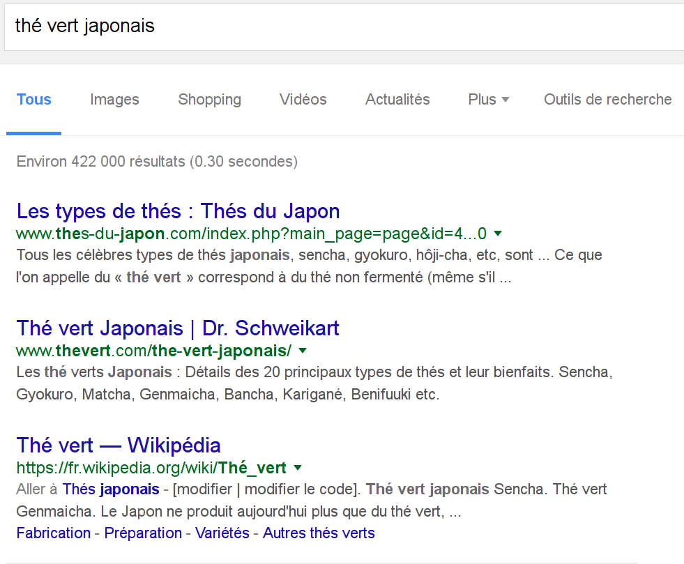

% Advanced Engine Search
% Alexandre Racine - Igor Milhit
% 2 mars 2016

# Introduction

## Google Search

* Par mots clés : ``panda roux``
* Opérateur par défaut : ``ET``
* Phrases simples : ``l'aéroport le plus proche``

## Terme manquant

## Exercice pratique

Nous voulons acheter du *thé vert japonais* à la fin de notre journée de travail.

Proposez-nous des adresses.

## Résulat 01

## Résultat 02

# Des mots clés particuliers

## Définition

``définition [terme]`` fait apparaître la définition du terme avant les résultats.

## Météo

## Calcul

## Conversion d'unité

# Recheche avancée

## Où ?

## Présentation de la Recherche avancée

exemple stats bibliothèque

## Mise en évidence syntaxe

amélioration dans le champ proposé par google

# Autres opérateurs

* inurl:
* cache:
* OR, |
* " "
* * (troncature)
